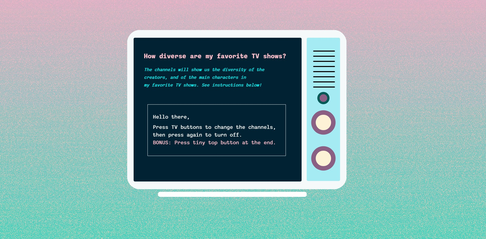

# diverse-tv
 
For this project, I analyzed my most-watched TV shows. I wanted to see how diverse they actually are.
The results showed that a lot of the stuff that I watch is made by white men (surprising, right?)
But, it was at least nice to see that some of the shows were a bit diverse when it comes to the main characters & cast. Women
are mostly represented, followed by BIPOCs, and lastly, Queer and Trans folks.
--
This project helped change my tv consumption habits and made me question who the shows are made by, and how diverse is the cast. I hope that this piece helps influence people to think twice about their watching consumption, and support inclusivity.

--
I coded the TV using P5.js to show how the entertainment industry is lacking inclusivity, I displayed that through two graphs.
Then, I included a little extra button for another screen to display some of the most diverse shows that made it to my list
(as a recommendation for people to watch), followed by a question, hoping that people will start thinking. 
Are they supporting the ‘currently’ underrepresented communities? I say ‘currently’ because I believe that this lack of
representation will soon change if we continue to talk about it and work on making a change.

